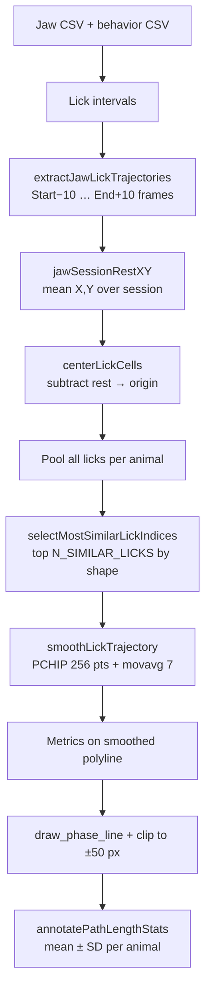

# Per-animal similar-lick jaw trajectory figures

This document describes the two MATLAB scripts that build **one figure per experiment (or TeLC cohort)** with **the most shape-similar licks per animal** (default 5), overlaid on a **session-centered** 100×100 px window.

| Script | Condition | Lick pool |
|--------|-----------|-----------|
| `bipoles_jaw_tip_one_random_lick_per_animal.m` | BiPoles opto, **laser ON** | First lick per **laser interval** (side view only) |
| `telc_spontaneous_one_random_lick_per_animal.m` | IRt_TeLC **Pre**, spontaneous | First lick per **bout** (`group_intervals` Assign ID) |

Both scripts share the same trajectory extraction, centering, smoothing, plotting, and distance metrics. They differ only in **which sessions/animals** are listed and **how behavior intervals are chosen**.

---

## How to run

From MATLAB, with `jaw_heatmaps` on the path:

```matlab
cd('C:\Users\wanglab\Desktop\Tongue-Whisker-Analysis\jaw_heatmaps');

bipoles_jaw_tip_one_random_lick_per_animal   % IRt + PCRt SVGs
telc_spontaneous_one_random_lick_per_animal % single TeLC SVG
```

**Outputs**

- BiPoles: `bipoles_jaw_tip_trajectories/bipoles_jaw_tip_one_random_lick_per_animal_IRt_BiPoles.svg` and `..._PCRt_BiPoles.svg`
- TeLC: `telc_spontaneous_tip_trajectories/telc_spontaneous_one_random_lick_per_animal.svg`

---

## End-to-end pipeline



---

## 1. Lick selection (behavior CSV)

### BiPoles (`bipoles_jaw_tip_one_random_lick_per_animal.m`)

- **Sessions:** Hard-coded side-view `*_side_view_jaw.csv` paths under `Ina\IRt_BiPoles\` and `Ina\PCRt_BiPoles\` (IRt animals 01–03; PCRt 02, 07, 08).
- **Sibling behavior file:** `*side_view_behavior*.csv` in the same session folder.
- **Laser filter:** `LASER_MODE = 'on'` — rows where `laser_...Assign ID >= 0`.
- **First per interval:** `FIRST_LICK_PER_LASER = true` — for each laser Assign ID, keep the tongue-area lick with the **earliest** `Interval Start` (typically the dominant lick in that opto window).
- **No** stereotyped filter, **no** trajectory probability filter (`PROB_MIN = 0`).

### TeLC (`telc_spontaneous_one_random_lick_per_animal.m`)

- **Sessions:** `telc_pre_side_jaw_paths()` → `Ina\IRt_TeLC##\IRt_TeLC##_Pre\*_1_jaw.csv` for TeLC08, 09, 11.
- **Sibling behavior file:** `*side_behavior*.csv`.
- **First per bout:** `readFirstLickPerBoutIntervals.m` — for each `Tongue_area_interval_detection_group_intervals_Interval Overlap Assign ID`, keep the lick with the **earliest** `Interval Start` in that bout.
- Same: no stereotyped filter, `PROB_MIN = 0`.

### Shape-similar selection (both scripts)

- All qualifying licks from all sessions for an animal go into one **pool**.
- Per animal, keep **`N_SIMILAR_LICKS = 5`** licks with the **most similar shape** (`selectMostSimilarLickIndices.m`):
  1. Each lick is resampled to **`SIMILARITY_N_POINTS = 64`** (PCHIP, no extra movavg).
  2. Translate so the first point is at the origin; **scale-normalize** by max distance from start (shape, not absolute size).
  3. Pairwise **mean pointwise Euclidean distance** between normalized curves.
  4. **Greedy cluster:** start from the pool **medoid** (lick with smallest sum of distances to all others), then repeatedly add the lick with the lowest mean distance to the set already chosen.
- If fewer than 5 licks exist in the pool, all are plotted.
- Selection is **deterministic** (no random seed).

---

## 2. Frame window: ±10 frames (`LICK_FRAME_PAD`)

Configured in both scripts as:

```matlab
LICK_FRAME_PAD = 10;   % extra frames before/after behavior lick Start/End
```

Implemented in `extractJawLickTrajectories.m`:

- For each behavior interval `[Start, End]`, jaw points are taken for frames  
  **`Start − 10`** through **`End + 10`** (inclusive).
- Points are sorted by frame index; duplicate frames are not merged (one row per matching frame in the jaw CSV).
- Rows with `Probability < PROB_MIN` are dropped when `PROB_MIN > 0` (default 0 = keep all).
- Licks with fewer than **`MIN_LICK_FRAMES = 2`** points after extraction are skipped.

**Intra-lick phase** for plotting (before smoothing): linear 0 at first extracted frame → 1 at last (`(0:L−1)/(L−1)`).

This padding captures a short approach and release of the jaw around the labeled tongue interval; it is **not** part of the behavior Start/End labels themselves.

---

## 3. Session centering (jaw rest at origin)

Centering makes trajectories comparable across sessions and aligns the plot window on a stable reference.

### Step A — jaw rest position (`jawSessionRestXY.m`)

For each jaw CSV:

\[
\text{rest}_x = \mathrm{mean}(X),\quad \text{rest}_y = \mathrm{mean}(Y)
\]

over **all frames in that session** (optionally filtered by `PROB_MIN`). This is the session’s average tracked jaw-tip location (“jaw rest”), not a single labeled rest frame.

### Step B — translate licks (`centerLickCells.m`)

Every point in every lick from that session is shifted:

\[
x' = x - \text{rest}_x,\quad y' = y - \text{rest}_y
\]

After centering, **jaw rest is at (0, 0)** in data coordinates.

### Step C — axes (`setupCenteredJawAxes.m`)

- Square axes, **`PLOT_HALF = 50`** → limits **[-50, 50]** on X and Y (**100×100 px**).
- `YDir` **reverse** (image coordinates).
- Phase colormap (`turbo` / `jet`) with `caxis [0 1]`.
- **`drawJawRestMarker.m`:** small **+** at (0, 0) marking centered rest.

### Step D — drawing clip (`draw_phase_line.m`)

Trajectories are drawn with `clipHalf = PLOT_HALF`: line segments are clipped to the same **±50 px** square (Liang–Barsky via `clipSegmentToSquare.m`) so long excursions do not expand the axes. Segments fully outside the window may not appear even if the raw data extend beyond ±50 px.

**Important:** Metrics (below) are computed on the **full smoothed centered polyline**, not only the visible clipped portion.

---

## 4. Smoothing and display

After random selection, each lick is drawn once per animal panel:

1. **`smoothLickTrajectory.m`:** PCHIP along \(t \in [0,1]\) to **`SMOOTH_N_POINTS = 256`**, then a **`SMOOTH_MOVAVG_WIN = 7`** moving-average pass for softer display lines. Phase on the smooth curve is `tq` (0 → 1).
2. **`draw_phase_line`:** single phase-colored polyline, **`LINE_WIDTH = 2`**, no scatter.
3. Shared colorbar: **Intra-lick phase (0 = start, 1 = end)**.

There is **no** outlier trimming or gap-breaking in these random-lick scripts (unlike some combined/session scripts).

---

## 5. Distance metrics

Metrics are computed **per lick** on the **smoothed** `(xsS, ysS)` polyline, then summarized **per animal** as **mean ± SD** over the selected licks (≤5) and written on the panel by `annotatePathLengthStats.m`.

### Path length (arc)

`trajectoryPathLength.m`:

\[
L_{\mathrm{arc}} = \sum_{i=1}^{N-1} \sqrt{(x_{i+1}-x_i)^2 + (y_{i+1}-y_i)^2}
\]

Total distance **along the curve** (sums every segment; back-and-forth motion increases this value).

### Max distance from start

`trajectoryMaxExcursionFromStart.m`:

\[
D_{\max} = \max_i \sqrt{(x_i - x_1)^2 + (y_i - y_1)^2}
\]

Distance from the **first point of the smoothed lick** (earliest padded frame after centering) to the **farthest** point on that lick. This is a simple “how far did the jaw get from where this lick started” measure and is usually **smaller** than arc length when the path loops or zigzags.

**Panel labels (example):**

```
Path length (arc): 76.1 ± 9.2 px
Max distance from start: 33.3 ± 2.9 px
```

Console logs list per-lick values and the same animal-level summaries.

---

## 6. CONFIG reference (both scripts)

| Parameter | Default | Role |
|-----------|---------|------|
| `LICK_FRAME_PAD` | `10` | Frames before Start / after End |
| `MIN_LICK_FRAMES` | `2` | Minimum jaw points per lick |
| `PROB_MIN` | `0` | Jaw tracking probability cutoff |
| `N_SIMILAR_LICKS` | `5` | Most similar licks per animal |
| `SIMILARITY_N_POINTS` | `64` | Resample count for shape ranking |
| `SMOOTH_N_POINTS` | `256` | PCHIP resampling for display |
| `SMOOTH_MOVAVG_WIN` | `7` | Extra smoothing (odd window) |
| `PLOT_HALF` | `50` | Half-width of square plot (px) |
| `LINE_WIDTH` | `2.0` | Trajectory line width |
| `SAVE_SVG` | `true` | Write vector SVG |

BiPoles-only:

| Parameter | Value | Role |
|-----------|-------|------|
| `LASER_MODE` | `'on'` | Laser-ON licks only |
| `FIRST_LICK_PER_LASER` | `true` | One lick per laser interval |

---

## 7. Helper files (shared)

| File | Used for |
|------|----------|
| `extractJawLickTrajectories.m` | Padded frame extraction |
| `jawSessionRestXY.m` | Session mean jaw position |
| `centerLickCells.m` | Subtract rest from lick coordinates |
| `setupCenteredJawAxes.m` | 100×100 centered axes |
| `drawJawRestMarker.m` | Rest marker at origin |
| `draw_phase_line.m` | Phase-colored line + square clip |
| `clipSegmentToSquare.m` | Line clipping to plot window |
| `trajectoryPathLength.m` | Arc length metric |
| `trajectoryMaxExcursionFromStart.m` | Max distance from lick start |
| `annotatePathLengthStats.m` | Panel text (mean ± SD) |
| `smoothLickTrajectory.m` | PCHIP + optional movavg |
| `selectMostSimilarLickIndices.m` | Greedy similar-shape picker |
| `readFirstLickPerBoutIntervals.m` | TeLC bout filter |
| `telc_pre_side_jaw_paths.m` | TeLC jaw CSV discovery |

BiPoles interval logic lives in **`readLickIntervalsByLaser`** (local function at the bottom of `bipoles_jaw_tip_one_random_lick_per_animal.m`).

---

## 8. What these figures are not

- They are **not** heatmaps or occupancy maps; they are **example trajectories** for qualitative comparison.
- They do **not** filter by lick duration, tongue area, or stereotypy.
- Arc length and max-from-start describe **pixel space in the centered side view**, not mm or 3D path length.
- Lick selection is deterministic (same pool → same picks).

For the broader `jaw_heatmaps` pipeline (per-session plots, combined grids, prob filters), see `README.md`.
